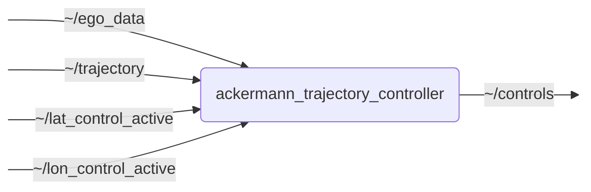

# `ackermann_trajectory_control`

This package contains a trajectory controller for Ackermann-steered vehicles. It is implemented as a ROS 2 C++ node that subscribes to trajectory_planning_msgs/Trajectory and publishes control commands as ackermann_msgs/AckermannDriveStamped.

## Nodes

### `ackermann_trajectory_controller`

#### Subscribed Topics

| Topic | Type | Description |
| --- | --- | --- |
| `~/ego_data` | `perception_msgs/msg/EgoData` | Ego data of the vehicle. Contains the current state (v, a, yaw, delta, etc.) of the vehicle |
| `~/trajectory` | `trajectory_planning_msgs/msg/Trajectory` | Trajectory to follow. Must be of type `DRIVABLE` |
| `~/lat_control_active` | `std_msgs/msg/Bool` | Indicates if lateral control is active |
| `~/lon_control_active` | `std_msgs/msg/Bool` | Indicates if longitudinal control is active |

#### Published Topics

| Topic | Type | Description |
| --- | --- | --- |
| `~/controls` | `ackermann_msgs/msg/AckermannDriveStamped` | Control commands for the vehicle: longitudinal acceleration and lateral steering angle |

#### Parameters

| Parameter | Type | Default | Description |
| --- | --- | --- | --- |
| `vehicle_frame_id` | `string` | `"base_link"` | Frame ID of the vehicle |
| `fixed_over_time_frame_id` | `string` | `"map"` | Frame ID of the fixed frame used for transformations over time (e.g. map) |
| `control_frequency` | `float` | `100.0` | Frequency of the control loop in Hz |
| `vehicle_state_timeout` | `float` | `0.2` | Maximum allowed age of the ego data in seconds |
| `wheelbase` | `float` | `3.1` | Wheelbase of the vehicle in meters (required for lateral control) |
| `selfsteergradient` | `float` | `0.00265` | Self-steer gradient of the vehicle (required for lateral control) |
| `longitudinal_lookahead_time` | `float` | `0.1` | Time in seconds for the longitudinal look-ahead |
| `lateral_lookahead_time` | `float` | `0.1` | Time in seconds for the lateral look-ahead |
| `max_longitudinal_acceleration` | `float` | `3.5` | Maximum allowed longitudinal acceleration in m/s^2 (constraint) |
| `min_longitudinal_acceleration` | `float` | `-5.0` | Minimum allowed longitudinal acceleration in m/s^2 (constraint, should be negative) |
| `max_longitudinal_jerk` | `float` | `5.0` | Maximum allowed longitudinal jerk in m/s^3 (constraint, absolute value) |
| `max_curvature` | `float` | `0.0` | Maximum allowed curvature (constraint, absolute value) |
| `max_curvature_rate` | `float` | `0.0` | Maximum allowed curvature rate (constraint, absolute value) |
| `max_curvature_acceleration` | `float` | `0.0` | Maximum allowed curvature acceleration (constraint, absolute value) |
| `use_speed_dependent_lateral_limits` | `bool` | `false` | Boolean indicating whether the controller uses speed-dependent curvature limits from a CSV file |
| `lateral_limits_csv` | `string` | `ament_index_cpp::get_package_share_directory("ackermann_trajectory_control") + "/config/example-limits.csv"` | CSV file path for speed-dependent curvature limits |
| `anti_windup_gain` | `float` | `1.0` | Anti-windup back-calculation gain |
| `use_back_calculation` | `bool` | `false` | Enable anti-windup back-calculation |
| `velocity_lookup` | `float[]` | `[-30.0, 30.0]` | List of velocities in m/s for which the following gains are defined |
| `feed_forward_acceleration_gain` | `float[]` | `[0.0, 0.0]` | List of feed-forward gains for the acceleration controller (mapping to velocity_lookup) |
| `feed_forward_steering_angle_gain` | `float[]` | `[0.0, 0.0]` | List of feed-forward gains for the steering-angle controller (mapping to velocity_lookup) |
| `dv_p` | `float[]` | `[0.0, 0.0]` | List of proportional gains for the velocity controller (mapping to velocity_lookup) |
| `dv_i` | `float[]` | `[0.0, 0.0]` | List of integral gains for the velocity controller (mapping to velocity_lookup) |
| `dv_d` | `float[]` | `[0.0, 0.0]` | List of derivative gains for the velocity controller (mapping to velocity_lookup) |
| `dy_p` | `float[]` | `[0.0, 0.0]` | List of proportional gains for the lateral controller (mapping to velocity_lookup) |
| `dy_i` | `float[]` | `[0.0, 0.0]` | List of integral gains for the lateral controller (mapping to velocity_lookup) |
| `dy_d` | `float[]` | `[0.0, 0.0]` | List of derivative gains for the lateral controller (mapping to velocity_lookup) |
| `dpsi_p` | `float[]` | `[0.0, 0.0]` | List of proportional gains for the heading deviation controller (mapping to velocity_lookup) |
| `dpsi_i` | `float[]` | `[0.0, 0.0]` | List of integral gains for the heading deviation controller (mapping to velocity_lookup) |
| `dpsi_d` | `float[]` | `[0.0, 0.0]` | List of derivative gains for the heading deviation controller (mapping to velocity_lookup) |

## Launch Files

### [`ackermann_trajectory_control.launch.py`](launch/ackermann_trajectory_control.launch.py)

| Argument | Default | Description |
| --- | --- | --- |
| `ego_data_topic` | `"~/ego_data"` | Input topic for ego data |
| `trajectory_topic` | `"~/trajectory"` | Input topic for the trajectory |
| `lat_control_active_topic` | `"~/lat_control_active"` | Input topic indicating lateral-control activation |
| `lon_control_active_topic` | `"~/lon_control_active"` | Input topic indicating longitudinal-control activation |
| `controls_topic` | `"~/controls"` | Output topic for control commands |
| `name` | `"ackermann_trajectory_control_node"` | Node name |
| `namespace` | `""` | Node namespace |
| `params` | `os.path.join(get_package_share_directory("ackermann_trajectory_control"), "config", "params.yml")` | Path to the parameter file |
| `log_level` | `"info"` | ROS logging level (debug, info, warn, error, fatal) |
| `use_sim_time` | `"false"` | Use simulation clock |
| `trace` | `"False"` | Enable tracing |
